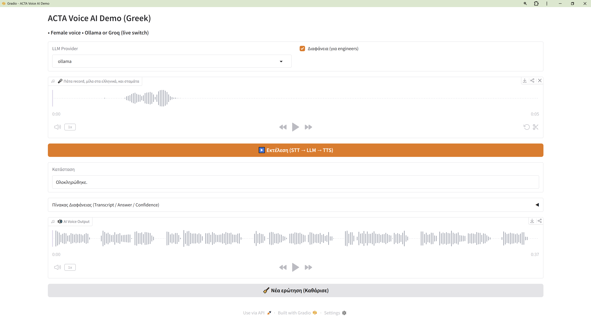

# 🎙️ ACTA Voice AI Demo  
### Greek Telecom Voice Assistant powered by LangGraph

An end-to-end Voice AI system that answers telecom-related questions in Greek using a structured pipeline:

- 🎤 Speech-to-Text (Faster-Whisper)
- 🧠 LLM (Ollama or Groq – runtime switch)
- 📊 Confidence evaluation
- 🔊 Neural Text-to-Speech (Edge TTS)
- 🔁 LangGraph orchestration
- 🖥️ Gradio interface

Designed as an AI portfolio demo demonstrating graph-based orchestration, multi-provider LLM support, and voice interaction.

---

## 🖥️ Demo Interface

```markdown

