# 🎙️ ACTA Voice AI Demo  
### Greek Telecom Voice Assistant powered by LangGraph

🚀 **Live Demo:**  
👉 https://huggingface.co/spaces/ankarb/gradio-whisper-langgraph

> ⚠️ If the demo appears inactive, please wait ~30 seconds for the Space to wake up.

An end-to-end Voice AI system that answers telecom-related questions in Greek using a structured pipeline:

- 🎤 Speech-to-Text (Faster-Whisper)
- 🧠 LLM (Ollama or Groq – runtime switch)
- 📊 Confidence evaluation
- 🔊 Neural Text-to-Speech (Edge TTS)
- 🔁 LangGraph orchestration
- 🖥️ Gradio interface

Designed as an AI portfolio demo demonstrating graph-based orchestration, multi-provider LLM support, and voice interaction.

---

```mermaid
flowchart TB
    A[🎤 Audio Input]

    subgraph G["LangGraph VoiceState"]
        B[stt<br/>audio_path → user_text]
        C[answer<br/>LLM call]
        D[confidence<br/>LLM call]
        E[tts<br/>answer_text → out_wav]
        Z((END))

        B --> C --> D --> E --> Z
    end

    F[🔊 Voice Output]

    A --> B
    E --> F

```

## 🖥️ Demo Interface

---

## 👨‍💻 Author

**Antonios Karvelas**  
AI Systems Engineer | Telecom Architect  

---
