# 🎙️ ACTA Voice AI Demo  
### Graph-Orchestrated Greek Telecom Voice Assistant

🚀 **Live Demo:**  
👉 https://huggingface.co/spaces/ankarb/gradio-whisper-langgraph

> ⚠️ If the demo appears inactive, please wait ~30 seconds for the Space to wake up.

---
🧠 **Overview  **
An end-to-end Voice AI system for telecom-domain question answering in Greek.

This project demonstrates graph-based orchestration using LangGraph, enabling:
- Structured pipeline execution
- Explicit state management
- Multi-LLM provider flexibility
- Confidence scoring
- Modular speech components

Designed as an architecture-focused demo showcasing how voice interfaces can be built using explicit state graphs instead of monolithic chains, 
and with extensibility in mind, allowing future integration of RAG nodes, tool-calling, or persistent memory.

---
🏗️ **System Architecture  **
Pipeline Components  
- 🎤 Speech-to-Text (Faster-Whisper)
- 🧠 LLM (Ollama or Groq – runtime switch)
- 📊 Confidence evaluation – Secondary LLM call
- 🔊 Neural Text-to-Speech (Edge TTS)
- 🔁 LangGraph StateGraph Orchestration
- 🖥️ Gradio UI (HuggingFace Spaces deployment)

---

---
🯠**Architectural Highlights  **
- Explicit state transitions (no hidden chain logic)
- Multi-provider LLM abstraction layer
- Separation of reasoning and confidence evaluation
- Graph-based orchestration suitable for scaling to multi-agent workflows
- Designed for telecom-domain extension (RAG-ready)
---
🚀 **Why LangGraph? **
Traditional voice assistants often use linear pipelines. 
This demo shows how graph-based orchestration enables:
- Clear control flow
- Extensibility (add RAG node, memory node, tool node)
- Deterministic execution paths
- Better debugging & observability
---

```mermaid
flowchart TB
    A[🎤 Audio Input]

    subgraph G["LangGraph VoiceState"]
        B[stt<br/>audio_path → user_text]
        C[answer<br/>LLM call]
        D[confidence<br/>LLM call]
        E[tts<br/>answer_text → out_wav]
        Z((END))

        B --> C --> D --> E --> Z
    end

    F[🔊 Voice Output]

    A --> B
    E --> F

```

## 🖥️ Demo Interface

---

## 👨‍💻 Author

**Antonios Karvelas**  
AI Systems Engineer | Telecom Architect  

---
